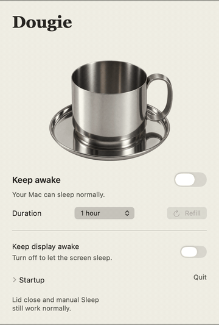

# Dougie

Dougie is a small macOS menu bar app that keeps your Mac awake. Its coffee cup drains with the timer; refill it to start again. Click the cup to stir it.

<p></p>

Requires macOS 14 or later. Closing the lid and choosing Sleep still work normally.

## Install from source

A signed, notarized download is planned. Until then, build Dougie from source:

```sh
./scripts/build.sh
open "build/Dougie.app"
```

This local build is ad hoc signed, so macOS may ask you to approve it in System Settings.

## Build and test

With Swift 6 and Xcode installed:

```sh
swift test --disable-sandbox
./scripts/package-release.sh 1.0.0
```

The packaging script creates a local `.zip`, `.dmg`, and SHA-256 file in `dist/`. Local artifacts are not notarized. See [Release process](RELEASE.md) for the public release steps.

## Contributing

Issues and pull requests are welcome. Please run `swift test --disable-sandbox` before opening a pull request. See [Artwork and credits](Resources/Artwork.md) for the cup asset.

## License

[MIT](LICENSE).
